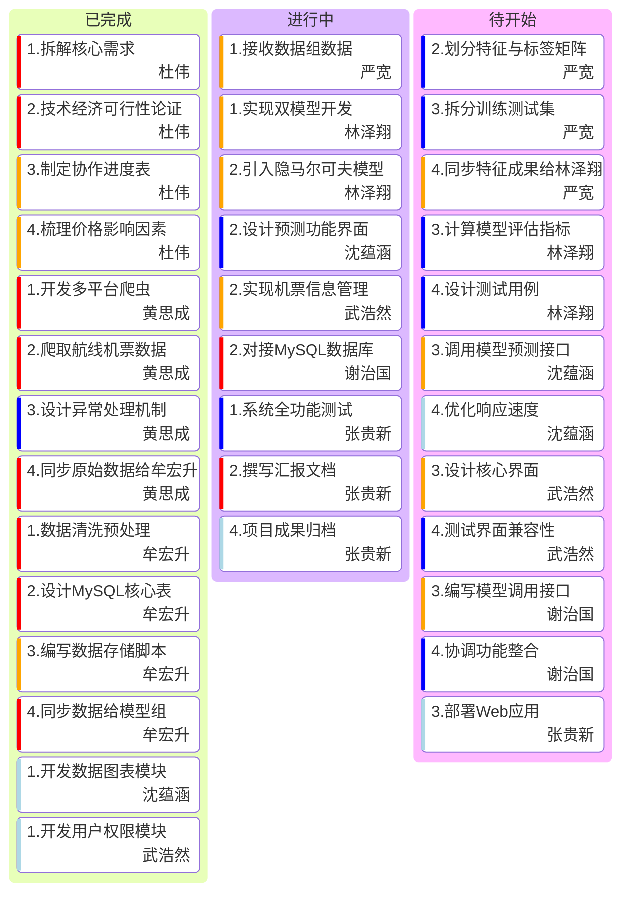

```mermaid
kanban
    已完成
        1.拆解核心需求@{assigned: '杜伟',priority: 'Very High'} 
        2.技术经济可行性论证@{assigned: '杜伟',priority: 'Very High'}  
        3.制定协作进度表@{assigned: '杜伟',priority: 'High'}    
        4.梳理价格影响因素@{assigned: '杜伟',priority: 'High'} 
        1.开发多平台爬虫@{assigned: '黄思成',priority: 'Very High'}   
        2.爬取航线机票数据@{assigned: '黄思成',priority: 'Very High'} 
        3.设计异常处理机制@{assigned: '黄思成',priority: 'Low'} 
        4.同步原始数据给牟宏升@{assigned: '黄思成',priority: 'Very High'}          
        1.数据清洗预处理@{assigned: '牟宏升',priority: 'Very High'}   
        2.设计MySQL核心表@{assigned: '牟宏升',priority: 'Very High'}  
        3.编写数据存储脚本@{assigned: '牟宏升',priority: 'High'} 
        4.同步数据给模型组@{assigned: '牟宏升',priority: 'Very High'} 
        1.开发数据图表模块@{assigned: '沈蕴涵',priority: 'Very Low'}   
        1.开发用户权限模块@{assigned: '武浩然',priority: 'Very Low'}   

    进行中
        1.接收数据组数据@{assigned: '严宽',priority: 'High'}
        1.实现双模型开发@{assigned: '林泽翔',priority: 'High'}  
        2.引入隐马尔可夫模型@{assigned: '林泽翔',priority: 'High'}
        2.设计预测功能界面@{assigned: '沈蕴涵',priority: 'Low'}
        2.实现机票信息管理@{assigned: '武浩然',priority: 'High'}
        2.对接MySQL数据库@{assigned: '谢治国',priority: 'Very High'}
        1.系统全功能测试@{assigned: '张贵新',priority: 'Low'}
        2.撰写汇报文档@{assigned: '张贵新',priority: 'Very High'}
        4.项目成果归档 @{assigned: '张贵新',priority: 'Very Low'} 

    待开始
        2.划分特征与标签矩阵@{assigned: '严宽',priority: 'Low'}  
        3.拆分训练测试集@{assigned: '严宽',priority: 'Low'}      
        4.同步特征成果给林泽翔@{assigned: '严宽',priority: 'High'}
        3.计算模型评估指标@{assigned: '林泽翔',priority: 'Low'}
        4.设计测试用例@{assigned: '林泽翔',priority: 'Low'}    
        3.调用模型预测接口@{assigned: '沈蕴涵',priority: 'High'}
        4.优化响应速度@{assigned: '沈蕴涵',priority: 'Very Low'}  
        3.设计核心界面@{assigned: '武浩然',priority: 'High'} 
        4.测试界面兼容性@{assigned: '武浩然',priority: 'Low'}
        3.编写模型调用接口@{assigned: '谢治国',priority: 'High'}
        4.协调功能整合@{assigned: '谢治国',priority: 'Low'} 
        3.部署Web应用@{assigned: '张贵新',priority: 'Very Low'} 
```