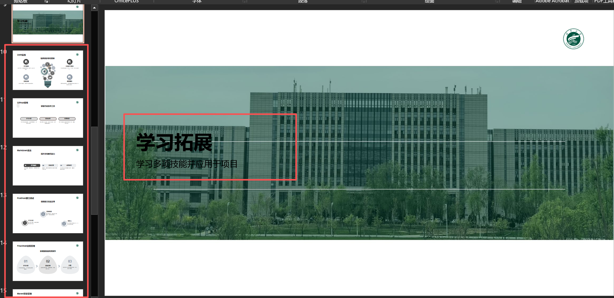
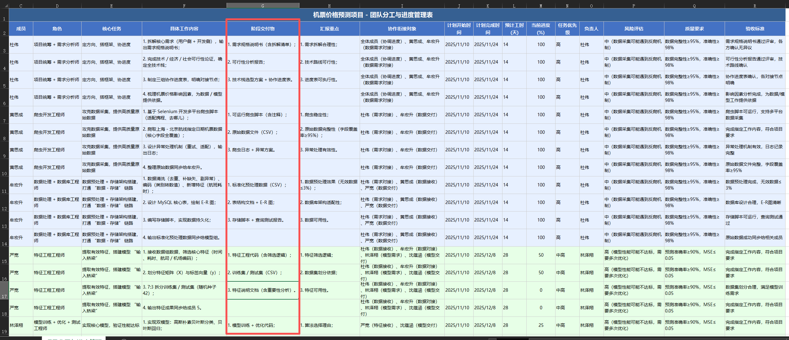
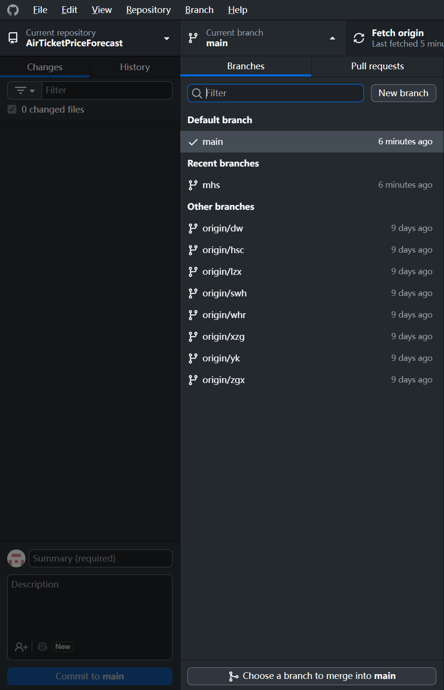
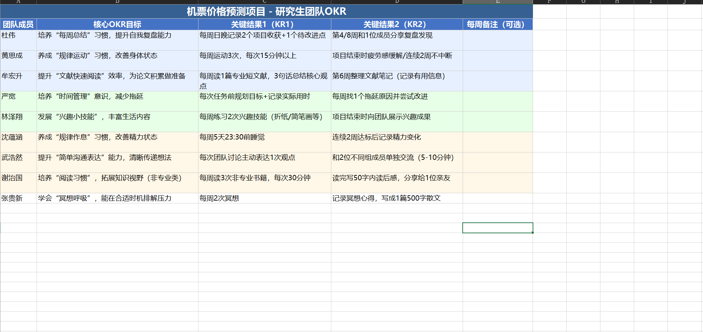
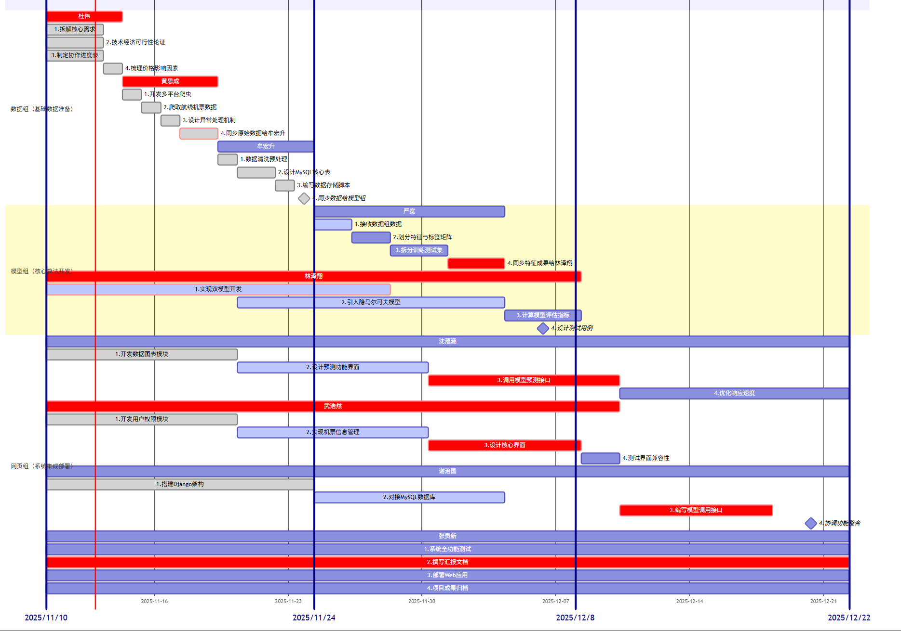
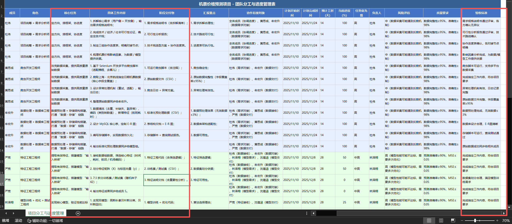
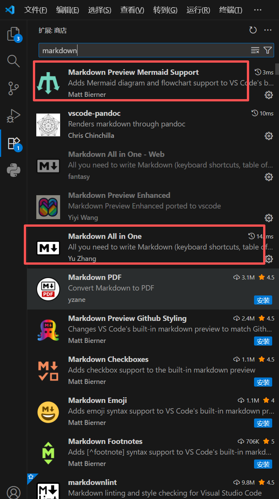

- # `github`远程仓库地址
  - `https://github.com/loganmhs/AirTicketPriceForecast.git`
- 
- # 组员真实任务  
  1. 用`AI`生成PPT中【学习拓展】后面部分的学习笔记，打包发在咱们的群里。
   
  2. 用`AI`生成分工表中要求的阶段交付物，和学习笔记一块打包。注意：查看《当前进度.md》或《当前进度.html》文件，只用提交本次汇报时已完成的相关文档。
  3. 提交`github`项目拉取动作的截图，下载`github desktop`图形化软件，选中自己的分支，参考示例如下，界面截全一点，与学习笔记打包在一起。
   
  4. 查看《团队OKR》中自己的内容，从应付老师角度来考虑是否舒服，不舒服的话把自己想调整的内容反馈给牟宏升。
  5. 熟悉一下《总体进度.md》或者《总体进度.html》文件，对自己的虚假工作心中有数，不要露馅就行，注意图上显示的截止时间和与其它组员的配合关系。
  6. 了解分工表中自己的具体分工，稍微做点准备，应付老师
   
  
- # 组员虚假任务
  - [《完善后的团队项目分工表.xlsx》](完善后的团队项目分工表.xlsx)

- # 温馨提示
- 如果要看以`.md`结尾的软件，建议在`vscode`中打开，在扩展商店中下载这两个插件，即可渲染。
- 多用`AI大模型`，一个效果不好换另一个，豆包、腾讯元宝、KiMi、通义千问、文心一言……

- # 黄思成额外任务
  - 将数据库整体导出，最好是以一种方便导入的方式导出，打包发在群里

- # 汇报安排
  - 第二次，数据组，牟宏升
  - 第三次，模型组，自行商定
  - 第三次，网页组，自行商定  

- # 请大家尽快，感谢配合
 
- # 如果有遗漏，请各位补充
  - 